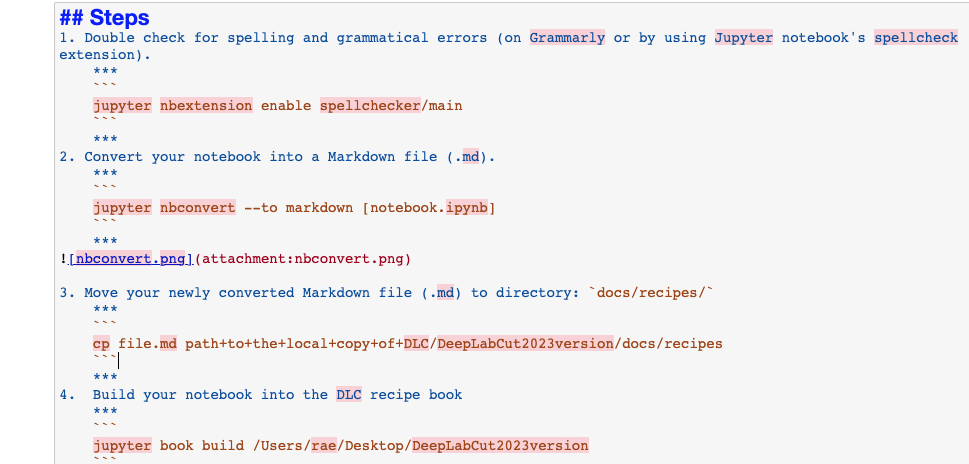
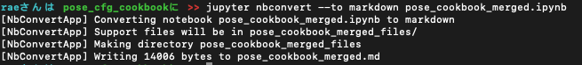
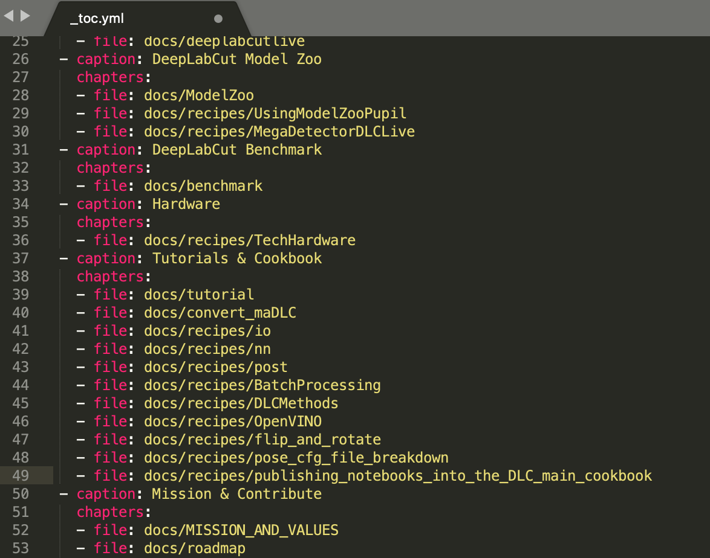
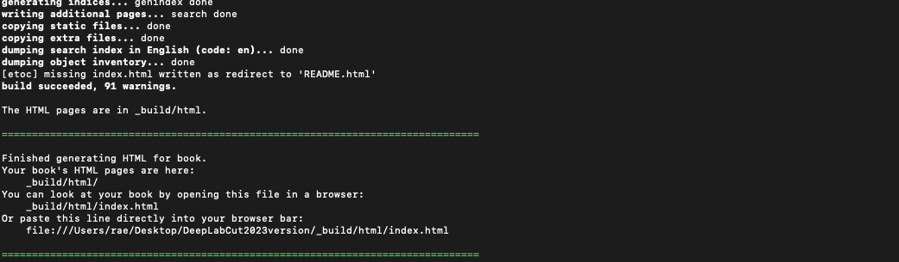
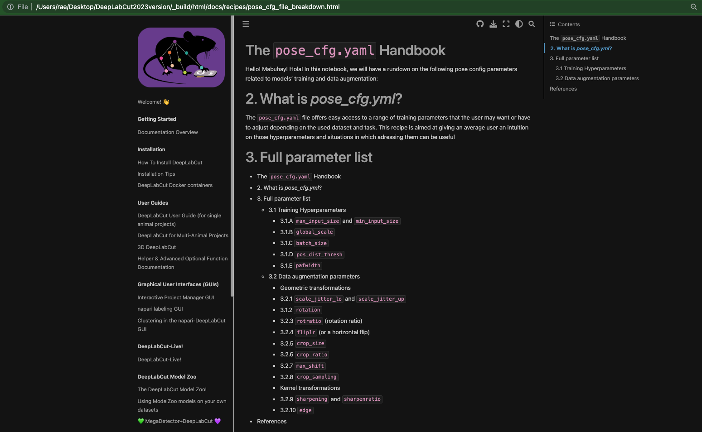

# Publishing Notebooks into the Main DLC Cookbook
*Date: 13 June 2023*


## Introduction
Publishing notebooks into the main DLC cookbook can be done in a few easy steps!

## Requirements
To accomplish this, you need the following installed:
- jupyter-book
- numpydoc
- nbconvert
- jupyter_contrib_nbextensions

    You can do this by running the following command:
    ***
    ```
    pip install jupyter-book numpydoc nbconvert jupyter_contrib_nbextensions
    jupyter contrib nbextension install --user
    ```
    ***
**Relevant Git repos:**
- DeepLabCut: https://github.com/DeepLabCut/DeepLabCut
    ```
    git clone https://github.com/DeepLabCut/DeepLabCut.git
    ```
- DeepLabCut2023version (forked from main DLC repo): https://github.com/DeepLabCutAIResidency/DeepLabCut2023version
    ```
    git clone https://github.com/DeepLabCutAIResidency/DeepLabCut2023version.git
    ```

## Steps
1. Double check for spelling and grammatical errors (on [Grammarly](#https://grammarly.com/) or by using Jupyter notebook's spellcheck extension called `spellchecker`).
    ***
    ```
    jupyter nbextension enable spellchecker/main
    ```
    ***
    Once installed, restart your notebook, and when you load your notebook again, you will see the incorrectly spelled words highlighted in red. See example below:
</img>
2. Convert your notebook into a Markdown file (.md).
    ***
    ```
    jupyter nbconvert --to markdown [notebook.ipynb]
    ```
    ***
</img>

3. Move your newly converted Markdown file (.md) to directory: `docs/recipes/`
    ***
    ```
    cp file.md path+to+the+local+copy+of+DLC/DeepLabCut2023version/docs/recipes
    ```
    ***
4. Add the path to your new_recipe.md under the Tutorials & Cookbook paths in the `DeepLabCut2023version/_toc.yml` file.
    ***
    ```
      - file: docs/recipes/pose_cfg_file_breakdown
    ```
    ***
</img>
5.  Build your notebook into the DLC recipe book
    ***
    ```
    jupyter book build /absolute/path/to/the/DLC/repoDeepLabCut2023version
    ```
    ***
    Example:
    ***
    ```
    jupyter book build /Users/rae/DeepLabCut2023version
    ```
    ***
    The build log should look like below:
    </img><br/>

5. Test locally by checking the `index.html` file in `/Users/rae/Desktop/DeepLabCut2023version/_build/html/`
</img>

6. When everything is a-okay, commit to Git. If not, edit your file and go to back to step 1.
    
    **`git status`** to check the local changes in your current project
    ```
    git status
    ```
    **`git add`** to add your file/s to the commit bin
    ```
    git add [filename]
    ```
    
    **`git commit`** to add your file/s to the commit bin
    ```
    git commit -m "commit message here; make it descriptive!"
    ```
    **`git pull`** or **`git rebase`** to update your local copy from the main branch.
    ```
    git rebase
    ```
    **`git push`** to push your changes to the main branch.
    ```
    git push
    ```
5. When everything's clear, confirm your pull request on the Git website: https://github.com/DeepLabCutAIResidency/DeepLabCut2023version

## All done!
